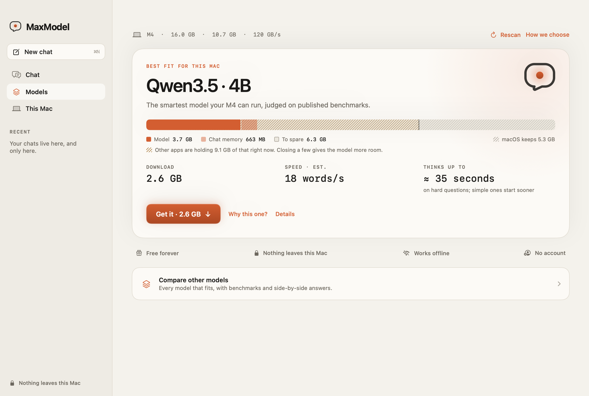

<p align="center"></p>

# MaxModel

**The smartest AI your Mac can run. Free, private, and offline.**

MaxModel reads your Mac's chip, memory, and memory speed, picks the most capable open model that runs well on it, and downloads it. Then you chat with it entirely on your Mac, and drop in screenshots, photos, and PDFs to ask about them. No account, no subscription, no cloud.

**[Download for Mac](https://dhrubsingh.github.io/maxmodel/)** · macOS 14 or later · Apple Silicon and Intel



- **Picked for your hardware.** Compares open models on published benchmarks and keeps only those that fit your Mac's memory and still answer at a comfortable pace, so a bigger model isn't chosen just because it fits.
- **Sees what you share.** Models that can see look at images directly; others read the text in them. PDFs work too, including scans.
- **Private by design.** Every answer is generated on your Mac. Chats, images, and documents never leave it.
- **Stays current.** MaxModel asks once whether to check for updates. Every update is signed and verified before it installs.

> **Opening it the first time:** early builds aren't notarized by Apple yet, so macOS says it can't verify the developer. Open MaxModel once, then go to **System Settings → Privacy & Security** and click **Open Anyway**. You only do this once; updates install without it.

Models are downloaded separately, from their publishers' Hugging Face releases, and keep their own licenses, which MaxModel shows before download. MaxModel itself is MIT licensed. To build it yourself, see [Build from source](#build-from-source).

## How it works in detail

*Formerly Hearth. Models and chats in `~/Library/Application Support/Hearth` move to `MaxModel` automatically on first launch.*

The **Assistants** screen leads with one hardware-aware starting recommendation, or the user's chosen assistant and **Continue chatting** after setup. Temporary memory pressure is explained separately from hardware fit. **Compare other assistants** opens the shortlist; **Best answers / Balanced / Light & quick**, comparisons, and the full grouped catalog remain in exploration and recommendation details. **Download and start chatting** downloads, verifies, installs, and loads without running a benchmark. Custom terms still require explicit review. **About this assistant** in chat includes knowledge limitations and expandable local performance details; deeper checks and tuning are optional.

MaxModel 0.8.0 preserves per-conversation drafts and the last open conversation across restarts. Conversations stay navigable while a reply runs, with a shortcut back to the active response. **Retry / Try again** preserves earlier attempts in a disclosure without duplicating the question or sending archived answers as context. **Continue** preserves any unsent draft, and **Edit question** creates a revised conversation while keeping the original. Failures stay with the affected reply, with direct recovery controls. Starter cards populate an editable draft and never overwrite an existing one.

Real conversations record only the latest per-model timing and process-memory observation locally, separately from controlled benchmarks; these observations do not rank answer quality or silently retune a model. Idle model memory is released after 15 minutes without interaction, or on memory pressure when no operation is running. The next message reloads it. System instructions include the current local date, actual capabilities, and the publisher's documented cutoff (or explicitly unknown); this does not supply newer knowledge or guarantee factual accuracy.

**Manage storage** shows every installed or paused download, independently of catalog filters. Use it to resume or remove downloads, measure speed, or release active model memory. **Compare example answers** opens recorded examples before download; **Try your question** compares installed models locally, one at a time. **Continue this chat** saves the chosen answer into a normal conversation.

MaxModel 0.8.0 includes **71 pinned configurations in 28 model groups across 12 families**: Qwen, SmolLM, Phi, Mistral, Llama, Gemma, DeepSeek, Granite, OLMo, Liquid, Falcon, and gpt-oss. Related sizes share one card. Filter by hardware fit, family, everyday/coding/reasoning use, or license, and sort by suggested order, download size, or name. Fits this Mac checks memory estimates and remaining download space; installed models do not need their download space a second time. Downloads are separate from the application. The model files are approximately 106 MB–63.4 GB in decimal units; the app displays binary GB/MB. Setup downloads the model; it does **not** train one.

The **About this assistant** panel shows **Knowledge cutoff**, with the publisher source, review date, and freshness explanation available on expansion. The chat footer and comparison also keep a quiet cutoff disclosure; full catalog cards can show it when technical details are enabled. The reviewed sources establish dates for 22 configurations; the other 49 say **Not documented**. Approximate dates stay approximate. A cutoff is not a release date or proof of factual accuracy, and dates claimed by a model in chat are not treated as evidence. These details are bundled for offline use; opening a source link is an explicit browser action. Maintainers review `scripts/model-knowledge.json`; the catalog builder carries that metadata forward without inferring dates from model names or related models.

### Requirements

- macOS 14 or newer.
- **Apple Silicon:** `dist/MaxModel.app` / `dist/MaxModel-macOS.zip`, tested on an M4 with 16 GB of memory.
- **Intel:** `dist/Intel/MaxModel.app` / `dist/Intel/MaxModel-macOS-Intel.zip`. Cross-built and checked for correct architecture, macOS deployment targets, complete runtime dependencies, notices, and archive signature. **Not runtime-tested on Intel hardware.** Each download includes only its own architecture.
- Adequate disk space for the selected model. MaxModel budgets room for macOS and other applications.
- Internet access to download a new model. All installed-model chat and benchmarks work offline.

The build is ad-hoc signed for local development. It is **not Developer ID signed or notarized** for public distribution. A public release needs the owner's Apple Developer credentials, signing, notarization, and hardware testing. Do not represent this package as a notarized public release.

## MVP UX validation (0.8.0)

All 71 tests passed with no skips, including real local inference for setup, retry, continuation, and switching conversations during generation. The offline smoke test passed with external networking denied. Native UI checks covered draft restoration, archived answers, edit preservation, starter input, assistant discovery, and expandable performance details. Both architecture-specific archives passed signature, runtime dependency, catalog, and license-notice checks. Intel is cross-built and statically verified, not runtime-tested on an Intel Mac. Logs and artifact hashes are recorded in `VALIDATION.json` under `mvpUX`.

## What is implemented

- Native SwiftUI interface, Mac hardware detection through system APIs and Metal.
- A single recommendation or installed-assistant home, optional model shortlist and full catalog, progressive technical details, hardware/storage and license filters, source links, answer comparisons, and a dedicated download library. Each entry checks its actual GGUF architecture against the pinned runtime.
- Clear Apache/MIT and custom-license labels. Custom terms require explicit user acceptance, saved against the bundled terms digest. Original licenses, policies, model cards, required attribution, and provenance are retained with installed weights; existing installations receive the notices too.
- Native CommonMark/GFM rendering: headings, emphasis, nested/numbered/task lists, quotes, tables, inline code, and fenced code with preserved whitespace, horizontal scrolling, and a copy-code button. Completed messages avoid repeated rendering during streaming.
- Separate, collapsible model thinking; a reasoning budget reserves room for a final answer. Scrolling up pauses automatic following, with a Jump to latest button. You can draft the next question while a response streams.
- Memory-aware configuration planning and a sourced capability ranking with explicit evidence limits. Three recorded sample tasks for each of Qwen3 4B, Qwen3 1.7B, and Gemma 4 E2B are bundled with exact weight hashes, dates, and reference hardware. These examples are not a quality leaderboard; models without recorded examples say so.
- Property-level Swift Observation, an isolated live reply and composer, and background state writes/hardware scans prevent token updates and typing from refreshing unrelated screens. Interactive model unloading waits off the main actor, and catalog search debounces expensive result updates while typing remains immediate. Cancellation propagates into background model verification.
- Sidebar navigation retains each visited screen's native hosting view, scroll position, and local view state. Inactive screens are hidden and lose keyboard focus; navigation does not load a model or trigger another hardware scan. On macOS memory-pressure warnings, inactive screens and rendered Markdown caches are released; conversations and unsent drafts remain in application state. Use Refresh hardware for an explicit scan.
- Bounded, single-result caches reuse recommendations and grouped catalog results until their hardware, storage, installation, or filter inputs change. Searchable text is prepared once. Original installed license/provenance documents are only rewritten when their bytes change, while missing or damaged documents and permissions are repaired.
- Explicit downloads, progress, ETA once throughput is available, pause/resume across restarts, disk-space checks, trusted SHA-256 verification, pinned repository revisions.
- Chat with the bundled llama.cpp engine, one active model at a time, streaming, cancellation, and automatic unloading when switching models.
- Exact prompt token counting; old turns are excluded as complete turns when needed, with a visible notice. An oversized latest message is rejected, not silently truncated.
- Local benchmark results with date, model digest, engine version, context length, chip, token count, and process resident memory. Resident memory is an observation, not total system GPU allocation.
- Local conversation persistence, export, conversation deletion, model removal, manual memory release, and process cleanup when the app exits or crashes.
- Download lock to prevent future model downloads. Existing models keep working.

The catalog is a maintained collection of popular model families, not every upload on the internet. **Metadata verified** means pinned file size/hash, GGUF architecture, and original license notices were checked. **Tested locally** means that exact weight configuration completed real inference tests; it does not assert answer quality. Larger models and custom-license entries are not all runtime-tested on this 16 GB Mac. GLM-4.7-Flash is currently withheld because a complete original model license notice could not be verified; the code repository's different license is not substituted (see `scripts/catalog-exclusions.json`). There is no fine-tuning, arbitrary model import, automatic multi-model routing, web search, document indexing, tool execution, phone app, or Windows/Linux build. Model strengths are editorial descriptions. Recommendations are not a claim that we independently established the smartest model; speed tests do not measure answer quality.

## Recommendations

The previous RAM-tier parameter caps and hand-assigned preference scores no longer choose the default. The planner ranks published benchmark signals, filters by actual file size and available storage, and estimates weights, runtime headroom, and conversation-cache memory. Everyday mode targets 2K–16K context; Longer chats can reach 64K within the pinned GGUF's declared maximum. It enables thinking when the reviewed evidence requires it, sizing the thinking budget (512–4,096 tokens) from the speed expected on this Mac; see **Speed** below. A measured-speed tuner can then adjust it within the same range and validates it again. Runtime loading failures have a conservative full-precision/shorter-context fallback; corrupted weights never bypass verification.

Hardware inspection uses Metal's recommended working set without double-counting unified memory and reserves RAM for macOS. **The recommendation is based on hardware only**: memory that other apps happen to hold at the moment never downgrades the pick. When free/inactive pages (plus memory released by the current model) fall short of the plan, MaxModel says so separately next to the recommendation ("Other apps are using memory right now"), and loading keeps its conservative shorter-context fallback. Pressure, thermal state, and Low Power Mode are shown in details. Hardware refreshes off the main thread on foreground activation, explicit refresh, and before model loading. Changing preferences updates suggestions without disrupting a running conversation.

**27 configurations currently have enough reviewed benchmark dimensions for automatic capability ranking.** All 75 retain hardware/configuration facts and remain available in the catalog. Missing evidence is never replaced with guessed quality scores. The offline archive links source pages, records source-content hashes and review dates, and binds facts to each exact GGUF digest. Reviewed inputs are in `scripts/recommendation-evidence.json`; `python3 scripts/build-recommendation-evidence.py` builds the archive using the catalog builder's cached pinned GGUF headers.

The disclosed heuristic weights MMLU-Pro 50%, IFEval 30%, and GPQA Diamond 20%. **Models are compared head to head only on the benchmarks both have published** (at least two shared dimensions), so a missing, often harder, test never inflates either side; the feasible model with the fewest head-to-head losses leads, then the most wins. Published scores describe full-precision weights. **Q4_K_M and finer precisions rank equally**: their differences are within benchmark noise, and Q4 reads the fewest bytes per token, so it is also the fastest. Only compression beyond Q4 costs ranking points (IQ4 0.5, Q3 1.5, IQ3 2, Q2/IQ2 7, IQ1 14; gpt-oss's native MXFP4 0). These allowances are a product policy informed by llama.cpp perplexity/KL-divergence comparisons, not measurements of each file; the details panel still labels each file's precision. The top Qwen3.5 models ship in several precisions (Compact IQ3, standard Q4, High-precision Q6, Near-full-precision Q8) for manual choice. Automatic picks prefer the Q4 copy, which ties on rank and runs faster; another precision is picked only when the Q4 copy is excluded, for example after a failed local check. **Best answers treats models within 2 points of the leader as tied and picks the fastest** of them, since such gaps are within benchmark sampling error and differences in publishers' evaluation setups. The band is strict, so an IQ3 file (exactly 2 points behind its own Q4 copy) never ties it. Qwen3.5-122B-A10B was evaluated and not added: its publisher scores (MMLU-Pro 86.7, GPQA 86.6, IFEval 93.4) give a composite of 88.69, a tie with Qwen3.5-27B (88.65) and within the band of Qwen3.5-35B-A3B (87.1), which reads about a third as many weights per token and would win the tie; its Q4 build is also sharded. Balanced favors lower resource cost within five points; Light & quick uses a fifteen-point band. This is **an approximate ordering of heterogeneous published evaluations**, not independently verified quality of the compressed weights, writing quality, or a universal intelligence score. Publisher thinking budgets and precision can differ substantially from MaxModel. No globally optimal intelligence claim is made. Broader controlled evaluations of exact quantizations remain necessary.

**Speed.** Fitting in memory is necessary but not sufficient. Each generated token reads the model's active weights once, so speed follows the chip's memory bandwidth, not its memory size. MaxModel looks up Apple's rated bandwidth for the chip (68 GB/s for M1 through 819 GB/s for M3 Ultra; 14-core M3 Max and M4 Max configurations use their narrower figures; unlisted chips get a cautious value for their tier, labeled as an estimate) and estimates generation speed as 55% of it divided by the bytes of active weights. Mixture-of-experts models count only their active parameters. On the development M4 the estimate is within 25% of every recorded local measurement (for example Qwen3.5 4B: 24 estimated, 25.5 measured tokens/s). Prompt reading is estimated with bandwidth as a proxy for GPU compute. Each goal's targets now apply before download: Best answers needs at least 5 tokens/s and a first answer within 45 seconds; Balanced 10 tokens/s and 20 seconds; Light & quick 15 tokens/s and 10 seconds. A model whose published results used extended thinking must fit at least 512 thinking tokens within that wait; leftover time buys more thinking, up to 4,096 tokens for Best answers and 2,048 otherwise. A matching local test replaces the estimate. Estimates describe the hardware and ignore Low Power Mode, heat, and other apps' load.

Best answers on representative Macs (from `.test-data/speed-aware/hardware-matrix.json`; speeds and waits are estimates):

| Mac | Pick | Speed | Thinking budget | First answer, hard question |
| --- | --- | ---: | ---: | ---: |
| M1, 8 GB | Qwen3.5 4B | 14 tokens/s | 512 | ≈ 40 s |
| M4, 16 or 24 GB | Qwen3.5 4B | 24 tokens/s | 768 | ≈ 33 s |
| M4 Pro, 24 GB | Qwen3.5 9B | 26 tokens/s | 768 | ≈ 30 s |
| M3 Pro, 36 GB | Qwen3.5 35B-A3B | 44 tokens/s | 1,536 | ≈ 36 s |
| M4 Pro, 48 GB | Qwen3.5 35B-A3B | 80 tokens/s | 2,816 | ≈ 36 s |
| M2 Max, 64 GB | Qwen3.5 35B-A3B | 117 tokens/s | 4,096 | ≈ 35 s |
| M4 Max, 128 GB | Qwen3.5 35B-A3B | 159 tokens/s | 4,096 | ≈ 26 s |

The 27B dense model fits on many of these Macs but reads about 17 GB per token; where it can afford the minimum thinking at all, it ties the 35B-A3B on published results and runs several times slower. On the 16 GB M4, Qwen3.5 9B misses the 45-second target by about two seconds, so this boundary is close; a local check on that Mac would settle it.

First-use speed checks and **Run local check** run synthetic prompts entirely locally. Thinking time is adjusted once from measured throughput and time to first answer, then three new prompts validate the resulting profile. This tuning can make a capable model practical without switching to a smaller one; it does not assert unchanged quality at a shorter thinking budget. The fuller check adds six deterministic sanity tasks (instructions, arithmetic, supplied facts, uncertainty, ordering, JSON); individual results are shown. They are not an intelligence benchmark. Matching three-prompt tests can exclude a model from automatic recommendations if it exceeds latency/memory limits or fails most basic checks; manual choice remains available. Tests must match chip, engine, weights, context, and configuration and be under 30 days old. Benchmarks never contain user chats. Preferences, profiles, failures, and measurements persist alongside existing local state; old data migrates without replacing conversations.

## Images and documents

Drop, paste (⌘V), or attach (paperclip) screenshots, photos, and PDFs in chat, up to 10 per message. Each appears as a chip right away and is read off the main thread: a Retina screenshot takes about 0.4 s (0.9 s for the first one after launch), and a 24-megapixel photo about 1.7 s, with the interface never pausing more than 40 ms in testing. Images are downscaled to 1,600 px, saved as JPEG with a thumbnail, and their text is recognized on device with Apple's Vision framework. PDFs keep their text layer; pages without one (scans) are read the same way, up to 40 pages.

**Models that can see.** 22 catalog configurations, including every Qwen3.5 size, Gemma 3 (4B and up), Gemma 4, Ministral 3, and Mistral Small 3.2, ship an image encoder (the publisher's F16 `mmproj` file, pinned to the same revision as the weights and hash-checked like them). It downloads automatically after its model, so chat can start sooner (672 MB for Qwen3.5 4B, about 0.9 GB for most others), or on demand from the composer or model details. It loads only when it fits this Mac's memory budget with the model. Each image is capped at 512 tokens: image tokens cost about four times as much to read as text, so up to 3,000 characters of recognized text go with each image to carry fine print. Follow-up questions reuse the already-encoded image. On the development M4, with Qwen3.5 4B and thinking off, the first answer about an image took 4.6–6.8 s depending on system load, a follow-up 0.5 s, and a real Retina screenshot question about 6 s.

**Models that can't see** get the recognized text, labelled as text from an image with layout and pictures unavailable, and the composer says so before sending, offering an installed model that can see. An image with no readable text tells the model to say it can't see it rather than guess.

**Long documents** are cut at a page boundary to fit the configuration's conversation window (about 15–20 pages at 16K tokens), and both the chip ("first 14 of 40 pages fit") and the model are told. Assistant instructions now name the running model and tell it to treat shared content as real and current; without that, Qwen3.5 4B called a real screenshot of itself a "mockup" because Qwen3.5 postdates its own training data.

## Privacy and storage

Default data location (`Hearth/` from earlier versions moves here on first launch):

```text
~/Library/Application Support/MaxModel/
├── Models/              # .gguf weights and image encoders (.mmproj.gguf), partial downloads, integrity receipts, .notices directories
├── Attachments/         # downscaled images, thumbnails, and recognized/extracted text for attachments, named by attachment ID
└── conversations.json   # chats, drafts (including unsent attachments), selected model, benchmarks, profiles, preferences, download lock, license acceptances
```

- Attachments never leave the Mac: text recognition, PDF reading, and image understanding all run locally. Original files are not copied; only the downscaled image and extracted text are kept, with owner-only permissions. Removing a chip or deleting the last conversation that uses an attachment deletes its files.

- Inference binds to `127.0.0.1` on an ephemeral port and requires a fresh random bearer token. The token is passed through the child environment, not the command line. The engine's web UI and tools are disabled.
- The engine receives an allowlisted environment, so inherited cloud, proxy, and agent settings cannot configure it.
- Follow-up chats can reuse the active model’s matching prompt prefix in local memory. There is no disk prompt-cache archive, and the auxiliary RAM cache is disabled; unloading the engine releases its context. Benchmarks and side-by-side comparisons use fresh prompt processing.
- The app has no remote inference URL or analytics implementation. The catalog and runtime are bundled.
- **App updates (Sparkle).** On the second launch, MaxModel asks whether to check for updates automatically. If you decline, it never checks on its own; **MaxModel → Check for Updates…** checks once. A check downloads the signed feed `appcast.xml` from GitHub Pages; no system profile, chat text, or model information is sent. Updates are verified against the app's built-in EdDSA public key before they are unpacked, the feed itself must be signed, and nothing installs without passing both checks.
- Only an explicit model download contacts Hugging Face and its HTTPS CDN. Source links open the browser only when clicked. No chat text is included in those requests.
- Model files are checked at installation and again before loading. Bundled license documents are hash-checked when the catalog loads. Downloads do not run Python or repository scripts.
- Markdown is rendered as native views. Remote images are not fetched, HTML is displayed as text, and only explicit clicks on HTTP(S) links can open a browser. No web view or JavaScript is used for responses.
- A model's custom license and incorporated use policies still govern use. The app preserves those documents and requires acknowledgement; it does not replace the publisher's terms with a blanket open-source license.
- Chats are stored locally in plaintext with owner-only permissions, under a directory marked to be excluded from automatic backup. FileVault/device security remains relevant; arbitrary third-party backups and user exports are outside the app's control.
- The app does not claim OS-wide isolation. The integration suite separately verifies offline operation under a macOS process sandbox that blocks non-loopback networking.
- Removing a model frees disk space and retains chats. Unloading releases the engine's memory and retains the downloaded file.

Development/testing can override the data directory with `HEARTH_DATA_DIR` and the engine path with `HEARTH_ENGINE_PATH`. These are environment variables, not UI options.

## Longer conversation memory and runtime optimizations (0.6)

Open **Performance & why → Conversation memory → Longer chats**. MaxModel plans up to **65,536 tokens**, bounded by the exact model's declared context limit and the available memory budget. Everyday mode retains its smaller preference-based window. These settings update recommendations; use the assistant again to apply a changed configuration. Saved chat messages remain intact.

The planner can use the bundled runtime's **Q8_0 key/value cache** on compatible Apple Silicon paths. Each 32-value block occupies 34 bytes instead of FP16's 64 bytes, a **46.875% reduction in attention-cache storage**, not in total model memory. Q8 is selected when reviewed layout estimates show at least 256 MiB of savings or it lets a requested window fit. Hybrid/sliding-window models without reviewed geometry keep FP16 when it fits. Unknown/unreviewed cache paths and Intel retain FP16. Compatibility metadata is derived from pinned GGUF dimensions and a reviewed architecture list, with representative runtime tests; it does not certify every weight configuration's accuracy.

The planner understands **Qwen3.5's recurrent/full-attention split** and **Gemma 4's shared and sliding-window caches**, using pinned metadata and the matching runtime implementation. Recurrent state remains FP32; shared layers are not counted twice. The rolling cache includes the fixed 512-token microbatch and alignment. At most **two partial-state checkpoints** are kept, with their memory included in the estimate; the runtime's default is 32. This bounds extra memory but can require more rereading after major changes to earlier context. Weight/runtime headroom and the system reserve still apply. Other layouts retain conservative estimates. In a planner test with a 4.8 GiB assistant budget, Gemma 4 E2B can use a 64K FP16 window, where the old dense-layer estimate allowed only a much shorter window.

**Configuration & Mac details** contains a precision override and layout explanation. Q8 introduces a possible accuracy tradeoff. A planned memory estimate is not a measurement of exact allocation. A compressed-cache load failure triggers a new FP16 plan within the budget; integrity failures never bypass verification. Configuration identity includes precision and the checkpoint-policy revision, so older speed and long-memory results do not transfer. Old saved profiles decode as FP16 and are replanned when reviewed geometry changes.

**Check longer memory on this Mac** adds a synthetic retrieval test to the local checks. Three facts appear near the beginning, middle, and end of a generated input. The actual tokenizer sizes the test, which reaches up to 32K input tokens or three quarters of the configured window. Results show input length, exact facts recovered, first-answer delay, and the generated answer. This is a limited retrieval/formatting check; passing does not establish broad long-document comprehension or validate the entire maximum window. It never reads user files or chats. A failed result is disclosed and affects that configuration's recommendation.

Long-history preparation now finds a fitting suffix using a logarithmic number of exact template/tokenizer requests, while dropping only complete old turns. For 1,000 turns, the regression test uses at most 12 fitting checks. The latest oversized turn still produces an actionable error. In-memory prefix reuse and efficient attention were already provided by the runtime; this release preserves them and explicitly enables the supported attention path required for Q8 V-cache operation.

Research reviewed on October 2, 2026:

| Research / technique | Application in MaxModel |
| --- | --- |
| [KIVI](https://arxiv.org/abs/2402.02750), [TurboQuant](https://arxiv.org/abs/2504.19874), [UltraQuant, revised September 2026](https://arxiv.org/abs/2606.20474) | Motivates compressing conversation memory. MaxModel ships existing GGML Q8_0, which is a different method. Their experimental compression ratios and throughput gains are not claimed here. UltraQuant's optimized AMD serving path is not a drop-in Mac implementation. |
| [FlashAttention](https://arxiv.org/abs/2205.14135) and [the pinned Metal implementation](https://github.com/ggml-org/llama.cpp/blob/7fe450e19/ggml/src/ggml-metal/ggml-metal-ops.cpp) | Use the bundled efficient-attention kernels. No custom CUDA-to-Metal kernel port or new FlashAttention speedup is claimed. |
| [YaRN](https://arxiv.org/abs/2309.00071) | Preserve each model's declared context and embedded positional settings. Arbitrary extrapolation can degrade answers; MaxModel does not force a generic scaling factor. |
| [DFlash](https://arxiv.org/abs/2602.06036), [DSpark](https://arxiv.org/abs/2607.05147), [runtime speculation support](https://github.com/ggml-org/llama.cpp/blob/7fe450e19/docs/speculative.md) | Investigated, not globally enabled. Drafting heads/checkpoints are model-specific, consume memory, and require workload-specific acceptance/latency validation. No speculative speedup is claimed. |
| [PagedAttention](https://arxiv.org/abs/2309.06180) | Primarily addresses serving many concurrent requests. MaxModel uses one local model slot; a server batching subsystem is not included. |

Maintainer decisions and hashes of reviewed runtime sources are in `scripts/context-optimization-research.json`. These optimizations improve memory use and execution; they do not add new training knowledge to a model.

## Build from source

Requires Xcode/Apple command-line tools with Swift 6.1 or newer and Python 3 for build/catalog maintenance. Swift Markdown 0.7.3 and its cmark parser are pinned in `Package.swift`/`Package.resolved`, compiled into the app, and require no network access at runtime. Sparkle 2.10.0 is pinned the same way and embedded as `Contents/Frameworks/Sparkle.framework`, trimmed to the target architecture. All of their license notices are included in the package.

```sh
python3 scripts/fetch-engine.py
bash scripts/build-app.sh
bash scripts/build-app.sh x86_64 # separate Intel artifact; does not replace the Apple Silicon app
```

On Apple Silicon, outputs `dist/MaxModel.app` and `dist/MaxModel-macOS.zip`; Intel builds use `dist/Intel/`. The fetcher pins llama.cpp `b11146` and verifies the release archive against a committed SHA-256. Build tools bundle and sign the runtime, libraries, catalog, and a process guardian. The guardian keeps the engine's PID unchanged and stops it if its parent app disappears. Packaging follows the runtime's actual dependency graph, removes unused command-line utilities, strips local/debug symbols, and ships every original notice as a real file (shared symlinks broke license reads when the app ran from an iCloud-synced folder). Every original notice still verifies byte-for-byte after ZIP extraction. Build inputs remain intact. App builds compile only the app product, not development tools.

**Distributable builds.** By default the app is ad-hoc signed, and Gatekeeper blocks it on any other Mac. To ship it, use a *Developer ID Application* certificate (Apple Developer Program) and a notarytool keychain profile:

```sh
xcrun notarytool store-credentials hearth-notary --apple-id YOU@example.com --team-id TEAMID
HEARTH_SIGN_IDENTITY="Developer ID Application: Your Name (TEAMID)" HEARTH_NOTARY_PROFILE=hearth-notary bash scripts/build-app.sh
```

Before building, the script checks that the identity is a Developer ID Application certificate (Apple Development certificates sign but are refused by notarization) and that the notary profile works. It then signs every engine binary inside-out with the hardened runtime and a secure timestamp, notarizes the ZIP, staples the ticket, re-archives, and runs `spctl --assess`. If Apple rejects the upload, it prints Apple's notarization log and removes the unnotarized ZIP. Run it once per architecture (`bash scripts/build-app.sh x86_64` for Intel).

The engine needs no extra entitlements under the hardened runtime: it finds its libraries through `@loader_path`, not `DYLD_*` variables, and loads them under library validation when all binaries share one Team ID. A copy signed this way with an Apple Development certificate loaded a model on Metal and answered. Ad-hoc signing with the hardened runtime fails that check because ad-hoc code has no Team ID; that is expected and not a distribution problem.

## Releases, website, and updates

The website is `site/`, published to [dhrubsingh.github.io/maxmodel](https://dhrubsingh.github.io/maxmodel/) by `.github/workflows/release.yml`. Pull requests run the tests and a package build (`.github/workflows/ci.yml`).

**To ship a version,** raise both `CFBundleShortVersionString` (for example `0.9.1`) and `CFBundleVersion` (an integer that must increase every release, or installed copies won't update) in `Resources/Info.plist`, then merge to `main`. The workflow sees a version with no release yet, runs the tests, builds and verifies both apps, signs both ZIPs and both update feeds with the Sparkle key, publishes GitHub release `vX.Y.Z` with the ZIPs, `release.json`, `appcast.xml` (Apple Silicon), and `appcast-intel.xml`, and redeploys the site with them. Merges that don't change the version only redeploy the site. The download page reads `release.json` for its version, size, and links, and shows first-launch instructions until a release is notarized.

Repository secrets:

| Secret | Needed for |
| --- | --- |
| `SPARKLE_PRIVATE_KEY` | Required. Signs updates. Its public half is `SUPublicEDKey` in `Info.plist`. |
| `DEVELOPER_ID_P12`, `DEVELOPER_ID_P12_PASSWORD` | Optional. Base64 of an exported Developer ID Application certificate (.p12) and its password. |
| `NOTARY_APPLE_ID`, `NOTARY_TEAM_ID`, `NOTARY_PASSWORD` | Optional, with the certificate. Apple ID, team ID, and an app-specific password for notarization. |

With the optional secrets present, releases are Developer ID signed, notarized, and marked notarized on the site; without them they are ad-hoc signed. Installed copies update either way, including from ad-hoc to notarized builds.

**The Sparkle key is irreplaceable.** Installed copies only accept updates signed with it. It lives in the maintainer's login keychain under the account `maxmodel` (`generate_keys --account maxmodel -p` prints the public key). Keep an offline backup: `.build/artifacts/sparkle/Sparkle/bin/generate_keys --account maxmodel -x maxmodel-sparkle.key`, store the file in a password manager, then delete it.

Each architecture follows its own feed, so an Intel Mac is never offered the Apple Silicon download. An end-to-end check of the update path (an installed 0.9.0 test copy updating itself to 0.9.1 from a local signed feed, and refusing a tampered download) passed before the first release.

To refresh the maintained catalog deliberately:

```sh
python3 scripts/update-catalog.py
```

Review catalog/licensing changes before releasing. The app itself never runs that script or refreshes model metadata remotely.
The reviewed inventory is `scripts/catalog-specs.json`. Use `--only MODEL_ID ...` to update selected entries. Existing weight revisions are preserved by default; `--refresh-weights` deliberately changes them. The maintainer script checks original-author licensing against the quantizer, reads architecture/memory metadata from each pinned GGUF header, and preserves original notices under `Sources/HearthCore/model-notices/`. Missing or inconsistent licensing blocks catalog publication. `--cached` is a maintainer convenience for reusing fetched repository metadata.

## Tests

```sh
bash scripts/test.sh                 # unit tests, no model download
bash scripts/test.sh --integration   # real inference; about 1.5 GB of model fixtures on first run
HEARTH_SNAPSHOT_DIR=/tmp/hearth-shots HEARTH_RECOMMENDATION_REPORT=/tmp/hearth-matrix.json bash scripts/test.sh # render home/recommendation PNGs for this Mac; write the simulated Mac lineup
.build/debug/hearth-smoke --families --download # four families; about 6.6 GB of additional fixtures
bash scripts/test-offline.sh         # same flows, with external networking denied by macOS
.build/debug/hearth-smoke --models qwen35-08,smollm2-135m,granite33-2b,deepseek-r1-15b,gemma4-e2b,olmo2-7b --download # additional architecture coverage
python3 scripts/test-process-cleanup.py # verify the packaged engine exits after its parent crashes
.build/debug/hearth-smoke --responsiveness --report .test-data/performance/updated-responsiveness.json # main-actor delay during three unload/load cycles
.build/release/hearth-smoke --examples # regenerate discovery examples from already-installed test fixtures
bash scripts/verify-package.sh       # extract and verify the standalone ZIP outside the project
bash scripts/verify-package.sh dist/Intel/MaxModel-macOS-Intel.zip --static # packaging checks without executing Intel code
```

Integration fixtures live in `.test-data/smoke/`, separate from real app data. The suite exercises verified download, pause/resume, authentication, single/multi-turn inference, oversized conversation handling, cancellation/recovery, two-model switching, deletion, benchmarks, persistence, and unloading. Tests use real weights and the actual Metal runtime. The benchmark report is written to `.test-data/smoke/benchmark-report.json`.
The family suite exercises Qwen3 0.6B, SmolLM3 3B, Phi-4 mini, and Ministral 3 3B: verified downloads, chat templates, multi-turn recall, cross-family switching, and three-prompt speed benchmarks. It saves `.test-data/smoke/family-report.json`. Phi missed an initial ambiguous recall question, then recalled the fact when the question explicitly referenced the previous message; this is recorded as a quality limitation, not hidden by the compatibility result. These are compatibility checks, not broad answer-quality evaluations. Compare families using your own tasks as well as the published evidence and local checks.

The suite also checks isolated typing/streaming observation, ordered background state saves, partial-answer recovery, debounced search, recommendation fit, pinned example provenance, comparison license gates, nested Markdown lists, fenced-code whitespace, unfinished streaming fences, tables, inert HTML/images/unsafe links, variant aggregation, storage budgets, and bundled license integrity. The additional architecture suite records runtime compatibility and answer-quality observations separately in `.test-data/smoke/catalog-report.json`; it never automatically accepts a custom license.

The native UI was also exercised using a separately identified validation copy: model comparison, download confirmation and installation, streaming chat, conversation restoration, download lock, memory release, and the in-app benchmark. The expanded UI checks cover grouped sizes, license gating without accepting terms, formatted responses, copy-code round trips, and manual scrolling with Jump to latest. The small 0.6B model is primarily useful for quick experimentation; it made factual mistakes during testing, reinforcing the need to evaluate answer quality separately from speed.

Packaging uses a clean temporary directory to prevent synced Desktop folders from adding Finder metadata before signing. The ZIP is created without those extra attributes. `verify-package.sh` validates the extracted archive in a clean location; a file provider can subsequently attach metadata to a loose `.app` on a synced Desktop.

## Project layout

```text
Sources/Hearth/          SwiftUI app, screens, application state
Sources/HearthCore/      catalog, hardware, storage, downloader, local engine
Sources/HearthSmoke/     real-model integration executable
Tests/HearthCoreTests/   deterministic safety and persistence checks
Resources/              app manifest
scripts/                reproducible packaging and verification
vendor/llama/           checksum-verified build input, not committed
```

## Upstream components

- [llama.cpp](https://github.com/ggml-org/llama.cpp), MIT. Its license is included in the packaged engine directory.
- [Qwen](https://huggingface.co/Qwen), Apache-2.0 for the selected catalog entries.
- [SmolLM3](https://huggingface.co/HuggingFaceTB/SmolLM3-3B) and [Ministral 3](https://huggingface.co/mistralai/Ministral-3-3B-Instruct-2512), Apache-2.0. Ministral is used for text only in MaxModel.
- [Phi-4 mini](https://huggingface.co/microsoft/Phi-4-mini-instruct), MIT.
- [Swift Markdown](https://github.com/swiftlang/swift-markdown), Apache-2.0 with Swift runtime exception, and [swift-cmark](https://github.com/swiftlang/swift-cmark), with original notices bundled.
- Each catalog entry links its original publisher and exact license; `Sources/HearthCore/model-notices/` preserves those documents, including custom terms and base-model notices.
- Compressed model files distributed by the publishers, [ggml-org](https://huggingface.co/ggml-org), [Unsloth](https://huggingface.co/unsloth) and [bartowski](https://huggingface.co/bartowski); immutable download revisions and digests are in `Sources/HearthCore/catalog.json`.

MaxModel is independent of these projects and is not affiliated with their authors.

## Responsiveness measurements

The 0.3.1 navigation layout probe uses the same synthetic 16-message Markdown/code conversation and full model browser in a 1220 × 820 native host. Across 15 repeat switches, median layout time fell from 48.0 ms to 1.6 ms; maximum fell from 113.0 ms to 5.4 ms. First visits still construct their screen. This is an offscreen debug-build layout measurement, including a 1 ms run-loop interval, not physical click-to-display latency. Reports: `.test-data/navigation/before-layout.json` and `final-layout.json`. Reproduce with `HEARTH_NAV_REPORT=/tmp/hearth-navigation.json bash scripts/test.sh`. UI checks separately confirmed retained catalog and chat scroll positions, unsent draft preservation, hidden inactive controls, working comparison/details sheets, and the new freshness disclosures in the release app.

On this M4, the same three-cycle Qwen3 0.6B unload/load probe measured a maximum main-actor scheduling delay of 140.8 ms before the nonblocking shutdown change and 5.2 ms afterward. This measures that lifecycle path, not all clicks or model generation throughput. Raw reports are in `.test-data/performance/baseline-responsiveness.json` and `updated-responsiveness.json`. The model still uses the existing C++/Metal runtime; these improvements do not claim a model tokens-per-second speedup.

A repeated long-prompt probe with Qwen3 0.6B measured time to first text of 0.92–0.93 s with prefix reuse disabled, then 0.018 s with reuse enabled. This is a controlled repeated-input case, not a claim that every answer becomes 50 times faster. See `.test-data/performance/prompt-cache.json`; reproduce with `.build/release/hearth-smoke --prompt-cache`. The implementation uses the [pinned llama.cpp prompt-cache API](https://github.com/ggml-org/llama.cpp/blob/7fe450e19/tools/server/README.md).


## Discovery redesign validation

Version 0.4.0 runs 32 checks with both opt-in integration probes enabled:

```sh
HEARTH_SETUP_FIXTURE="$PWD/.test-data/smoke/Models/smollm2-135m.gguf" HEARTH_NAV_REPORT=/tmp/hearth-navigation.json bash scripts/test.sh
```

The setup integration check requires that existing test model. It copies the verified fixture into an isolated complete partial download, runs one-click setup through verification and installation, loads the real local engine, generates a reply, and checks saved conversation state. It does not contact a model host. Without the two probe environment variables, those two checks are skipped. The release UI was separately reviewed in an isolated preview and the user's app; evidence and logs are recorded in `VALIDATION.json` and `.test-data/discovery-redesign/`.

## Footprint and efficiency (0.4.0)

The Apple Silicon bundle is **27,094,856 bytes (25.8 MiB)**, down from **37,738,566 bytes (36.0 MiB)** before this pass: **28.2% smaller**. The ZIP is **11,901,304 bytes (11.4 MiB)**, down **13.9%**. These figures exclude downloaded model weights, which remain the main storage and inference-memory cost. All 240 original notice documents are preserved, with 129 duplicate copies sharing bundled bytes.

A debug-build probe performs 2,000 repeated catalog/recommendation reads: 3,630.9 ms before result reuse, 4.4 ms after, with the same 50,000 accumulated results. This measures repeated derived-state work, **not model generation speed or physical click latency**. Native repeat-navigation layout remained about 2–3 ms median in this pass. Raw package, catalog, and layout reports are in `.test-data/optimization/`.

Regression coverage includes cached-result invalidation, retained observation subscriptions, reclaiming inactive native views without losing drafts, and idempotent license preservation/repair. The final stripped Apple Silicon runtime passed offline authentication, multi-turn chat, context trimming, cancellation/recovery, model switching, deletion, benchmarking, persistence, unloading, and crash-cleanup checks. The production app was opened with the user's existing data and its saved-state hash remained unchanged. The Intel archive passed static packaging checks only. Neither package is Developer ID signed or notarized.

## Recommendation validation (0.5.0)

All **46 tests passed, with none skipped**, including the real offline setup flow and native navigation probe. The final packaged Apple Silicon engine also passed offline multi-turn inference, authentication, context limits, cancellation/recovery, switching, deletion, benchmarking, persistence, unload, and parent-crash cleanup. Both architecture-specific archives passed signature, dependency, catalog, recommendation-evidence, and original-notice checks. Intel remains statically verified only.

On this M4 with 16 GB memory, real calibration produced these observations at a 16K conversation window:

| Model | Tuned thinking allowance | Generation speed | First answer | Basic checks |
| --- | ---: | ---: | ---: | ---: |
| Qwen3.5 4B | 768 tokens | 25.5 tokens/s | 26.3 s | 6/6 |
| Gemma 4 E2B | 1,792 tokens | 49.8 tokens/s | 5.3 s | 6/6 |

These are synthetic-prompt measurements with other apps running, not controlled quality comparisons or guarantees for arbitrary questions. The six checks cover basic instruction following, arithmetic, supplied facts, missing information, ordering, and structured output. They do not establish overall intelligence. Qwen3.5 9B was evaluated by the planner using published evidence and memory estimates, **not downloaded or runtime-tested in this pass**.

The native UI was exercised in an isolated preview: preferences, source disclosures, configuration details, model switching, automatic local calibration/tuning, matching measured performance, and a post-switch reply containing bullets and code. The final user app was opened on Assistants with the original conversation, eight messages, and selected model preserved. No test prompts were added to the user's chats.

The final Apple Silicon app is **27,482,833 bytes (26.2 MiB)** and its ZIP **12,048,791 bytes (11.5 MiB)**, excluding model weights. The Intel ZIP is **12,288,232 bytes (11.7 MiB)**. The native offscreen layout probe measured a 1.50 ms median and 2.74 ms maximum across 15 repeat switches; this is not physical click latency. Exact hashes, raw calibration records, the simulated hardware matrix, and validation scope are recorded in `VALIDATION.json` and `.test-data/recommendation/`.

## Context optimization validation (0.6.0)

All **56 tests passed with none skipped**, including real offline setup, native navigation, old-state decoding, model-specific memory accounting, precision fallback, preference persistence, measurement invalidation, strict retrieval grading, and complete-turn trimming. The final Apple Silicon package passed the offline regression and crash-cleanup checks; both architecture packages passed static archive verification. Intel was not run on physical Intel hardware.

An exploratory 16K-window comparison on this M4 observed the following process resident memory after approximately 12K input tokens. Thinking was disabled; values and stochastic outputs varied between runs, and other apps were running. This preceded the final two-checkpoint cap. It guides defaults and does not establish a controlled quality or speed improvement:

| Model | FP16 process memory | Q8 process memory | Basic checks, FP16 / Q8 | Retrieved facts, FP16 / Q8 |
| --- | ---: | ---: | ---: | ---: |
| Qwen3 4B | 4.60 GiB | 3.58 GiB | 5/6 / 4/6 | 0/3 / 0/3 |
| Qwen3.5 4B | 3.18 GiB | 3.01 GiB | 5/6 / 5/6 | 3/3 / 3/3 |
| Gemma 4 E2B | 3.20 GiB | 3.07 GiB | 5/6 / 5/6 | 3/3 / 3/3 |
| SmolLM3 3B | 3.00 GiB | 2.52 GiB | 4/6 / 4/6 | 3/3 / 3/3 |

Smaller cache did not consistently increase generation speed; Gemma slowed in this comparison. The precision override, selective defaults, and transparent check results remain necessary. The Qwen3 retrieval failure in both formats demonstrates why allocated capacity is not evidence of reliable recall.

With the **final checkpoint policy**, Qwen3.5 4B at a **32,768-token Q8 window** passed six basic checks and recovered three facts from **24,560 input tokens**. The native UI then loaded and tuned Gemma 4 E2B at a **49,152-token FP16 window**, passed all six basic checks, and recovered all three facts from **32,763 input tokens**. Its short-prompt benchmark measured about **55 tokens/s and 5.6 s to first answer**; the long retrieval input took **86.9 s to first answer**. The supported 64K setting is also covered by planner tests; this native UI run exercised 49K under the memory available at the time.

Raw records are in `.test-data/context-optimization/`: `comparison-summary.json`, `cache-probe-32768-compact.json`, `ui-long-context-result.json`, and the test/package logs. The UI preview used separate data and generated no saved chats. The production app preserves the user's existing conversation and selected model. All test prompts and inference remained local.


## Adaptive execution optimization (0.7.0)

**Performance & why → Tune for this Mac** runs an optional, cancellable local comparison for an installed assistant. Normal setup remains quick; tuning never downloads another model, trains weights, or reads a user's chats. It holds the weights, context, cache precision, and thinking budget fixed while comparing compatible CPU/core and microbatch settings, experimental Metal backend sampling, and verified n-gram drafting. Hybrid/recurrent/shared-KV paths skip unreviewed drafting. The runtime chooses GPU offload within its device allowance instead of assuming every GPU holds every layer; CPU-only execution is covered by the validation CLI.

The policy is portable across supported Macs; a measured setting is not. Profiles are tied to hardware (including CPU topology, GPU and memory), OS, power mode, exact model, runtime/configuration, and a 30-day validity window. Moving state to another machine or changing power mode invalidates the measured settings. Critical memory pressure, serious thermal throttling, power-mode changes during a run, cancellation, and candidate failures keep previous settings. Intel downloads contain the Intel runtime; Windows, Linux, and phones still require platform/backend ports and testing.

The bounded search uses three synthetic workloads: reading a longer input and returning JSON, writing a small function, and editing repeated text. It warms the engine, disables prompt reuse for timed samples, uses a monotonic clock and greedy sampling, and compares exact output hashes and token counts. A candidate must reduce total response time by at least 8%, stay within the memory budget, and avoid a per-workload or first-answer regression greater than 15% plus a small scheduling tolerance. A promising candidate and the baseline are repeated; both runs must be stable within 15%, and the gain must persist. All previously passing basic checks must remain passing, with at least four of six passed. Results and trial notes are inspectable, and **Restore automatic settings** removes a saved tune.

These checks do not prove overall intelligence, factual correctness, identical stochastic answers, or faster performance on every task. A model can pass simple checks and still make mistakes. Keeping the defaults is a valid optimization result. A backend may decline experimental sampling internally and fall back to CPU; MaxModel reports the setting requested and measures the actual result, rather than claiming a kernel was used.

Generation now follows reviewed publisher recommendations for Qwen3, Qwen3.5, Gemma 4 E2B/E4B/31B, SmolLM3, and the original DeepSeek R1 Qwen distillations. Other models explicitly retain MaxModel defaults. General chat uses sampling; greedy decoding is limited to controlled synthetic checks. Sources and revision/hash provenance are in `scripts/adaptive-optimization-research.json`; publisher links are also exposed in Configuration & Mac details.

The optimization boundary is deliberate: no target-specific EAGLE3/DFlash/DSpark/MTP downloads, custom TurboQuant kernels, arbitrary context extrapolation, or retraining are shipped. Such additions need compatible kernels and target weights, license/integrity handling, memory accounting, and model/backend-specific quality evidence before becoming automatic options. The candidate/measurement/promotion layer is the extension point for them.

Reproduce local execution checks with existing permissive fixtures:

```sh
HEARTH_ENGINE_PATH="$PWD/vendor/llama/llama-server" .build/debug/hearth-smoke --optimize qwen3-17b,qwen35-08 --direct
HEARTH_ENGINE_PATH="$PWD/vendor/llama/llama-server" .build/debug/hearth-smoke --optimize qwen3-06b --direct --cpu
```

Reports are written to `.test-data/adaptive-optimization/`. Omitting `--direct` preserves the planned thinking budget. The app always checks the actual selected configuration. CLI probes use isolated fixture storage and never create conversations.

### Release validation

All **64 tests passed, with no skips**, including real local setup, cancellation that unloads the experimental engine, migration, hardware/model/runtime invalidation, memory and quality gates, and native navigation. The final packaged engine passed inference, persistence, switching, deletion, benchmarking, and crash-cleanup checks; external networking was denied for the offline regression. Both ZIPs passed signature, dependency, architecture, and original-notice validation. Intel still needs runtime validation on physical Intel hardware.

Local optimizer probes covered Qwen3 1.7B (Metal), Qwen3.5 0.8B (hybrid), DeepSeek R1 1.5B with 512 thinking tokens, and Qwen3 0.6B with GPU offload disabled. The native UI completed an isolated Qwen3 0.6B run, saved the result, displayed the trial details, and created no chats. None of these checks established a repeatable additional execution speedup on this M4 under the current system conditions; defaults were retained. The original one conversation / eight messages and selected model were preserved byte-for-byte at the conversation-content level. Detailed scope and records: `.test-data/adaptive-optimization/VALIDATION.json`.

The 0.7.0 bundles are 27,774,271 bytes (ARM) and 27,375,764 bytes (Intel); ZIP downloads are 12,166,586 and 12,413,145 bytes respectively, excluding model downloads. No runtime dependency or speculative draft-model download was added.

## Speed-aware recommendation validation

All **79 tests passed with none skipped**, with the setup, navigation, recommendation-matrix, and snapshot probes enabled; the setup probe loads the real engine and generates a reply. Engine-backed tests need loopback networking and Metal, so run them outside restricted command sandboxes. New checks cover chip bandwidth lookup, speed estimates against M4 measurements, the minimum-thinking and wait rules, near-ties going to the faster model, precision variants not shifting the tie window, and a one-entry-per-model shortlist. The home screen and recommendation details were rendered offscreen for this M4 (`.test-data/speed-aware/snapshots/`). Both architecture packages were rebuilt and passed signature, catalog, notice, and dependency verification; the Apple Silicon engine started from the extracted ZIP. Intel remains statically verified only, and both builds remain ad-hoc signed. Records: `VALIDATION.json` under `speedAwareRecommendations`.
